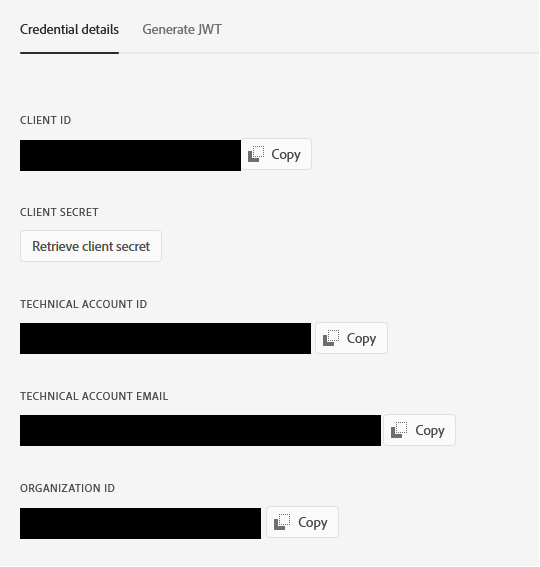

# Connection Setup
{:."no_toc"}

<details open markdown="block">
  <summary>
    Table of contents
  </summary>
  {: .text-delta }
1. TOC
{:toc}
</details>

# Setting up a Connection

Setting up a connection is a two-step process.

1. Construct authenticator object
2. Use authenticator object to construct a connection object

> **Note**: The `auth_dict` option is no longer available as it was in `2.x` releases.
> Connections must be constructed with an authenticator object.

# JWT Service Account Authentication (`JWTAuth`)

The `JWTAuth` authenticator is designed to work with Service Account (JWT) credentials
created in the [Adobe Developer Console](https://developer.adobe.com/console/).



It requires the Organization ID, Client ID, Client Secret and Tech Account ID that are
found on the credentials page. It additionally requires the contents of a private
key file associated with a public key that has been registered with the service.

```python
from umapi.auth import JWTAuth
from umapi import Connection

jwt_auth = JWTAuth(
  org_id="your org ID",
  client_id="your client ID",
  client_secret="your client secret",
  tech_acct_id="your technical account ID (not email)",
  priv_key_data="contents of the private key file (as string)",
)

conn = Connection(auth=jwt_auth)
```

## Additional `JWTAuth` Options

`JWTAuth`'s constructor supports a few optional parameters.

### `ssl_verify`

(default: `True`)

SSL verification can be optionally disabled if needed. This should only be done if
you are having trouble connecting to the UMAPI's authentication endpoint. Certain
network configurations may make it difficult or impossible to make a valid SSL
connection.

> It is always better to resolve connection issues in the environment. Use this
> option as a last resort.

During the calls, you will also see  a warning from requests:

```
InsecureRequestWarning: Unverified HTTPS request is being made to host
'ims-na1.adobelogin.com'. Adding certificate verification is strongly 
advised. See: https://urllib3.readthedocs.io/en/latest/advanced-usage.html#ssl-warnings
```

### `auth_host`

(default: `ims-na1.adobelogin.com`)

Controls the authentication host. This setting should generally never need to
be changed.

### `auth_endpoint`

(default: `/ims/exchange/jwt/`)

Controls the authentication endpoint. This setting should generally never need to
be changed.
